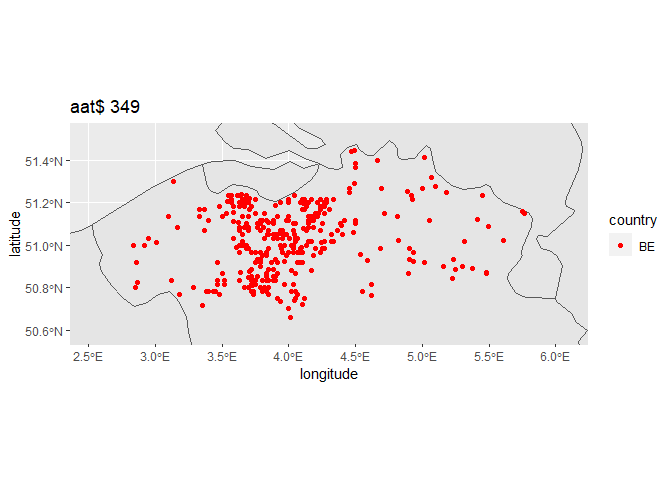
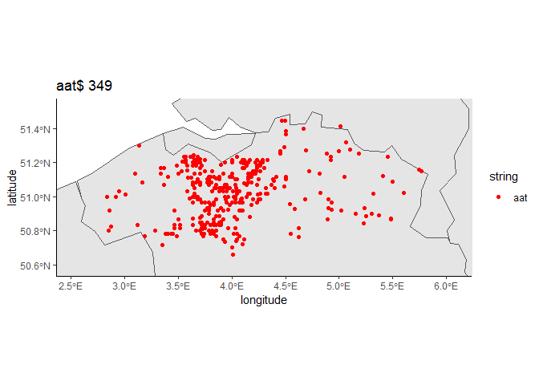

<!-- README.md is generated from README.Rmd. Please edit that file -->

## toponym

<!-- badges: start -->
<!-- badges: end -->

Welcome to the `toponym` GitHub page!

The initial goal of the `toponym` package is having a tool to easily
visualize the distribution of toponyms (= place names). When a regular
expression is given, a map is generated displaying all populated
locations matching it. If needed, the plot can be saved locally as .png
file. A list of locations in form of a data frame can be temporary saved
in the session environment or to the working directory as .csv file as
well.

For questions about which toponyms are prevalent in a region, the
`toponym` package searches for the most frequent toponym prefixes or
suffixes, checks how often they appear in said region, and generates
maps of those toponyms with signifant frequency. This way, you will
quickly have a large number of maps helping you finding toponyms which
show distributions that are fruitful to be examined further.

## Installation

In order to install this package, you will need `devtools`. You can
download and load the current development version of `toponym` from
[GitHub](https://github.com/Lennart05/toponym) with:

``` r
# install.packages("devtools")
# library ("devtools")
devtools::install_github("Lennart05/toponym")
```

## Create a simple map

The function `top()`, meaning “toponym”, creates maps of places matching
the regular expression. By default, it only looks at places in Germany,
as the script was initially created to find slavic toponyms in Germany.
The following code is a simple example of this:

``` r
library(toponym) # load package
top("itz$") 
#> 
#> Dataframe data_itz saved in global environment.
```


The plot shows all locations, which end with “-itz” in Germany, their
total frequency (2182), and stores the data in the global environment.
As you can see, most occurrences are located in the former slavic
settlement zone, indicating that the ending may be of Slavic origin. In
this case, we know that already.

## List suffixes specific to a region

If we want to find out, which toponyms appear frequently in one region
compared to the rest, we can run this:

``` r
top.candidates(countries = "DE", count = 75, len = 3, rat = .8)
#> 
#> Dataframe data_top_75 saved in global environment.
#>   ending  ratio frequency
#> 1   itz$ 95.78% 2090/2182
#> 2   kow$   100%   229/229
#> 3   ün$ 89.13%   164/184
```

The output is a data frame giving us information about the ratio and
frequency of each ending. This means essentially that 95.78% of the
places ending with “-itz” are in the polygon roughly covering the former
slavic settlement zone. Even though the ending is less common in total,
“-kow” may be of interest too as all occurrences are found in the
polygon. To be clear what happened: Other common suffixes in Germany
such as “-orf”, most of which coming from “-dorf”, are filtered out
since they did not match our fairly high threshold of 80% `rat = .8`.
`count = 75` and `len = 3` means that we filtered the 75 most frequent
suffixes with a length of three-characters.

Instead of applying this data frame with interesting candidates on your
own, there is another function doing this automatically.

## Creating multiple maps at once

``` r
candidates.maps(countries = "DE", count = 75, len = 3, rat = .8)
```

Running this with the same settings leaves us with a map of every ending
from before saved in the working directory in a separate folder called
“plots” as well as the respective data frames in another folder called
“data frames”. At this point, you can skim through or closely examine
the maps at a later date.

## Exemplary usage

To illustrate `toponym`, we make a quick step by step rundown. Let’s
look at Belgium: The two main regions, Flanders and Wallonia (we ignore
Brussels), have each one dominant standard language, alongside dialectal
variations. Dutch is dominant in the northern region, Flanders, and
French is dominant in the southern region, Wallonia, except small German
communities near the German border. Is this division also reflected by
toponyms? First, we need at least one polygon of a region. As part of
the package, the coordinates for both regions are provided as
`toponym::flanders_polygon` and `toponym::wallonia_polygon`. Thus, we
could run this:

``` r
### find suffixes typical in Flanders
head(top.candidates(countries = "BE", count = 100, len = 3, rat = 0.8,
 lons = toponym::flanders_polygon$lons, lats = toponym::flanders_polygon$lats))
#> 
#> Dataframe data_top_100 saved in global environment.
#>   ending  ratio frequency
#> 1   oek$ 99.84%   635/636
#> 2   aat$ 99.71%   348/349
#> 3   erg$ 94.63%   317/335
#> 4   ide$ 95.52%   213/223
#> 5   ken$ 96.43%   189/196
#> 6   gem$   100%   186/186
```

As the data frame shows, there are many suffixes almost only appearing
in Flanders but the limitation to three characters could cut the actual
suffixes off. For example, let’s take a closer look at “-aat” which is
the second most frequent in total:

``` r
top("aat$", "BE")
#> 
#> Dataframe data_aat saved in global environment.
```

 The
high density of places ending with “-aat” in the middle region stands
out and as we knew from the data frame earlier almost all (99.71%)
appear in our polygon. Looking at the full names (after generating this
map we end up with a data frame of the selection in the global
environment), it’s notable that the ending is in fact “-straat” meaning
as much as “-street”. From here on, a closer examination could start, e.
g., asking which conditions led to the frequency in the middle region.
And in addition, we could again use the `candidates.maps()` function
with the same parameters and check each map:

``` r
candidates.maps(countries = "BE", count = 100, len = 3, rat = 0.8, 
  lons = toponym::flanders_polygon$lons, lats = toponym::flanders_polygon$lats)
```

## Finding prefixes

As one last example we look at dominant prefixes in the other region
Wallonia. For that the parameter `type` needs to be set to “^” as the
default option searches for suffixes (“\$”):

``` r
head(top.candidates("BE", 100, 4, 0.8, type = "^", 
  toponym::wallonia_polygon$lons, toponym::wallonia_polygon$lats))
#> 
#> Dataframe data_top_100 saved in global environment.
#>   ending  ratio frequency
#> 1  ^Les  99.53%   212/213
#> 2  ^Gran 97.62%     82/84
#> 3  ^Sain 96.25%     77/80
#> 4  ^Peti 95.89%     70/73
#> 5  ^Mont 94.03%     63/67
#> 6  ^Haut 98.15%     53/54
```

Next, we could look at one of them to see their distribution and form.
We suspect that it is of French origin and include France and
Luxembourg:

``` r
top("^Gran", c("BE", "FR", "LU"))
#> [1] "FR.txt saved in package directory"
#> [1] "LU.txt saved in package directory"
#> 
#> Dataframe data_Gran saved in global environment.
```

 Most
cases seem to be at the border and some, but very few, appear in
Flanders too. The great majority stems from “Grand” or “Grande” – an
exception is for example “Grange”. As we might have expected, “Gran-”
occurs also throughout France but curiously not in Luxembourg. In order
to eliminate candidates such as “Grange”, the length parameter `len`
must be increased and the function needs to be run multiple times with
different lengths.

## The functions

The core functions are again as follows:

-   `top()` generates one map with all locations matching the regular
    expression
-   `top.candidates()` generates a list of prefixes or suffixes frequent
    in one given region (as polygon)
-   `candidates.maps()` generates maps and lists on your computer out of
    these frequent prefixes and suffixes

For help type `?function`

## Limitations

It should be clear that this tool merely helps one find frequent
toponyms. Less frequent ones, ones with different spelling yet of the
same origin or others which are of multiple origins but have the same
form (e.g. “-au” in Germany) require in depth examination.

## Regular expression

The possible queries with regular expressions are broader and wider than
these examples illustrate. For a concise description of which regular
expressions exist and how they can be used, head over to [the
guide](https://cran.r-project.org/web/packages/stringr/vignettes/regular-expressions.html)
provided by CRAN.

## Data

The data is kindly provided by [GeoNames](https://www.geonames.org/) and
will be automatically downloaded from there when you call any of the
core functions. It is recommended to save the data of the countries you
look at in the package directory. This is the default option of the
function `get.data()` but it is possible to place it in the temporary
folder by changing the parameter to `save = FALSE`.

## Polygon

The polygons were created with [Google My
Maps](https://www.google.com/maps/about/mymaps/). The functions allow
you to provide your own polygon if you want to test other regions. This
is a provisional solution and is planned to be replaced by a service
within R because, first, this requires users to have a Google account
and, second, the polygon creation and export is not adapted in such a
way that it’s easily and quickly possible.

## Future work

We plan to update and improve the package in the future. This includes a
more detailed documentation, feedback for users when errors occur,
different coloring or forms for each regular expression, the mentioned
import of polygons and more. We look forward to any feedback or ideas!
