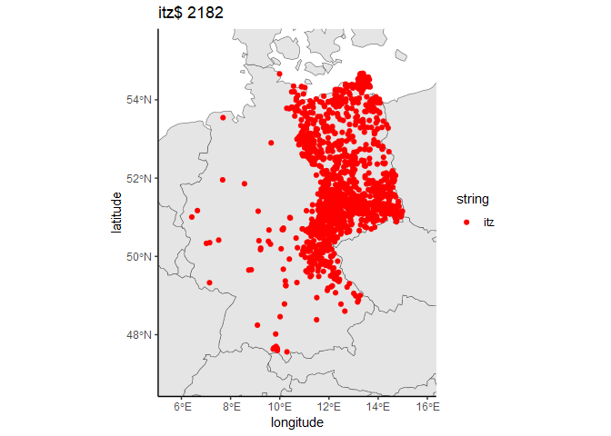

<!-- README.md is generated from README.Rmd. Please edit that file -->

## Toponym

<!-- badges: start -->
<!-- badges: end -->

The initial goal of the `toponym` package is having a tool to easily
visualize the distribution of toponyms. When a regular expression is
given, a map is generated displaying all populated locations matching
it. If needed, the plot can be saved locally as .png file. A list of
locations in form of a data frame can be temporary saved in the session
environment or to the working directory as .csv file as well.

For questions, which toponyms are specified to a region, the `toponym`
package searches for the most frequent toponym endings, checks how often
they appear in said region, and generates maps of those toponyms which
significantly frequently appear there. This way, you will quickly have a
large number of maps helping you finding toponyms which show
distributions that are fruitful to be examined further.

## Installation

In order to install this package, you will need `devtools`. You can
download and load the current development version of `toponym` from
[GitHub](https://github.com/Lennart05/toponym) with:

``` r
# install.packages("devtools")
# library ("devtools")
devtools::install_github("Lennart05/toponym")
```

## Create a simple map

The function `top()`, meaning “toponym”, creates maps of places matching
the regular expression. By default, it only looks at places in Germany,
as the script was initially created to find slavic toponyms in Germany.
The following code is a simple example of this:

``` r
library(toponym)
top("itz$") 
#> [1] "DE.txt saved in package directory"
#> 
#> Dataframe data_itz saved in global environment.
```



The plot shows all locations, which end with “-itz” in Germany, their
total frequency, and stores the data in the global environment. As you
can see, most occurrences are located in the former slavic settlement
zone, indicating that the ending may be of Slavic origin. In this case,
we know that already.

## List endings specific to a region

If we want to find out, which toponyms appear frequently in one region
compared to the rest, we can run this:

``` r
top.candidates(countries = "DE", count = 75, len = 3, rat = .8)
#> 
#> Dataframe data_top_75 saved in global environment.
#>   ending  ratio frequency
#> 1   itz$ 95.78% 2090/2182
#> 2   kow$   100%   229/229
#> 3   ün$ 89.13%   164/184
```

The output is a data frame giving us information about the ratio and
frequency of each ending. This means essentially that 95.78% of the
places ending with “-itz” are in the polygon roughly covering the former
slavic settlement zone. Even though the ending is less common in total,
“-kow” may be of interest too as all occurrences are found in the
polygon. To be clear what happened: Other common endings such as “-orf”,
most of which coming from “-dorf”, are filtered out since they did not
match our fairly high threshold of 80% `rat = .8`. `count = 75` and
`len = 3` means that we filtered the 75 most frequent endings with a
three character length.

Instead of applying this data frame with interesting candidates on your
own, there is another function doing this automatically.

## Creating multiple maps at once

``` r
candidates.maps(countries = "DE", count = 75, len = 3, rat = .8)
#> 
#> Dataframe data_top_75 saved in global environment.
#> 
#> Dataframe data_itz saved as csv in dataframes folder of the working directory.
#> Saving 7 x 5 in image
#> 
#> Plot plot_itz.png saved in plots folder of the working directory.
#> 
#> Dataframe data_kow saved as csv in dataframes folder of the working directory.
#> Saving 7 x 5 in image
#> 
#> Plot plot_kow.png saved in plots folder of the working directory.
#> 
#> Dataframe data_n saved as csv in dataframes folder of the working directory.
#> Saving 7 x 5 in image
#> 
#> Plot plot_n.png saved in plots folder of the working directory.
```

Running this with the same settings leaves us with a map of every ending
from before saved in the working directory in a separate folder called
“plots” as well as the respective data frames in another folder called
“data frames”. At this point, you can skim through or closely examine
the maps at a later date.

## Data and Polygon

The data is kindly provided by [GeoNames](https://www.geonames.org/) and
will be automatically downloaded from there. It is recommended to save
the data of the countries you look at in the package directory. This is
the default option of the function `get.data()` but it is possible to
place it in the temporary folder by changing the parameter to
`save = FALSE`.

The polygons were created with [Google My
Maps](https://www.google.com/maps/about/mymaps/). The functions allow
you to provide your own polygon if you want to test other regions.
