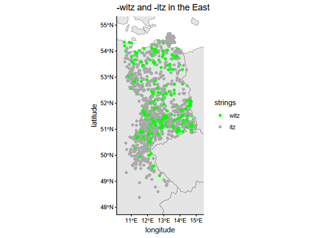

toponym
================
March 12, 2026

<!-- README.md is generated from README.Rmd. Please edit that file -->

<!-- badges: start -->

[](https://github.com/Lennart05/toponym/actions/workflows/R-CMD-check.yaml)
<!-- [](https://CRAN.R-project.org/package=toponym) -->
<!-- badges: end -->

Welcome to the `toponym 2.0.0` GitHub page!

The `toponym` package supplies users of R with tools to visualize and
analyze toponym (= place name) distributions. It is intended as an
interface to the [GeoNames](https://www.geonames.org/) data. A regular
expression filters data and in a second step a map is created displaying
locations which comply with it. The functions make data and plots
available for further analysis—either within R or in the working
directory. Users can select regions within countries, provide
coordinates to define regions, or specify a region within the package to
restrict the data selection to that region or compare regions with the
remainder of countries.

## Installation

<!-- You can install the most recent [CRAN](https://cran.r-project.org/) release with:
&#10;
``` r
## Install CRAN version of < toponym >
install.packages("toponym")
```
&#10;-->

In order to install this package from
[GitHub](https://github.com/Lennart05/toponym/tree/toponym-CRAN), you
will need `devtools`. You can download and load the current development
version of `toponym` with:

``` r
## Install development version of < toponym > from GitHub
# install.packages("devtools")
# library ("devtools")
devtools::install_github("Lennart05/toponym", ref = "dev-CRAN")
```

## Create a simple map

The function `top()`, meaning “toponym”, outputs data complying with a
regular expression. Minimally one or more strings and one or more
countries (in that order) are given as input. The following code is a
simple example of this:

``` r
library(toponym) # load the package
data_itz <- top("itz$", "DE")
```

A data frame named `data_itz` is stored in the Global environment
listing all locations which end in -itz in Germany.

For the purpose of plotting outputs of `top()` and edited data frames,
we offer the `mapper()`function. This accepts a user-defined title,
legend, colors, and groups. An example using the previously created data
frame is the following, where occurrences of -witz and -itz east of a
10.5 longitudinal line are displayed:

``` r
itz_east <- data_itz[data_itz$longitude > 10.5,]
itz_east$color <- "darkgrey"                # creates color column with color dark grey
witz_indices <- grep("witz", itz_east$name) # stores indices for lines containing "witz" 
itz_east[witz_indices, "color"] <- "green"  # sets color of "witz" entries to green
itz_east[witz_indices, "group"] <- "witz"   # sets group labels with "itz" to "witz"
mapper(itz_east, title = "-witz and -itz in the East")
```



## Country designations

The data is meant to cover maps and toponyms of the world. The function
`country()` lets users access all permitted country and region
designations used by this package. The query `country table` returns the
entire data frame.

``` r
head(country(query = "country table"))
#>   ISO2 ISO3       Country
#> 1   AW  ABW         Aruba
#> 2   AF  AFG   Afghanistan
#> 3   AO  AGO        Angola
#> 4   AI  AIA      Anguilla
#> 5   AX  ALA Aland Islands
#> 6   AL  ALB       Albania
```

If you want to access the row of a specific country, you can either
provide the ISO2 code, ISO3 code or the country name:

``` r
country(query = "Argentina")
#> [[1]]
#>   ISO2 ISO3   Country
#> 9   AR  ARG Argentina
# returns the respective row for Argentina

country(query = "ARG")
#> [[1]]
#>   ISO2 ISO3   Country
#> 9   AR  ARG Argentina
# returns the same row
```

If `regions` is set to `1`, the function returns all region
designations:

``` r
country("Mali", regions = 1)
#> [[1]]
#>       name        ID       
#>  [1,] "Bamako"    "MLI.1_1"
#>  [2,] "Gao"       "MLI.2_1"
#>  [3,] "Kayes"     "MLI.3_1"
#>  [4,] "Kidal"     "MLI.4_1"
#>  [5,] "Koulikoro" "MLI.5_1"
#>  [6,] "Mopti"     "MLI.6_1"
#>  [7,] "Ségou"     "MLI.7_1"
#>  [8,] "Sikasso"   "MLI.8_1"
#>  [9,] "Timbuktu"  "MLI.9_1"
# returns all region names and IDs of Mali available in the data
```

## Frequent toponym substrings

`topFreq()` lets users find strings frequently recurring in toponyms. A
simple example for the Philippines would be:

``` r
topFreq(countries = "Philippines",
        len = 3,
        limit = 10,
        type = "$")
#> toponyms
#> gan$ ang$ ong$ yan$ uan$ ion$ nan$ tan$ lan$ san$ 
#> 1767 1258 1136  770  709  615  604  552  551  510
```

Among all toponyms in the data for the Philippines
(`countries = "Philippines"`), these are the ten (`limit = 10`) most
frequent trailing (`type = "$"`) strings consisting of (a length of)
three characters (`len = 3`).

The additional parameter `polygon` allows users to restrict the data to
a subset of the selected countries. Only toponyms within the polygon are
selected. The polygon needs to intersect or be within a country
specified by the `countries` parameter. The package contains a
predefined polygon for the historical Danelaw area of England for
purposes of illustration:

``` r
topFreq(countries = "GB",
        len = 3,
        limit = 10,
        polygon = toponym::danelaw_polygon
)
#> toponyms
#> ton$ een$ ham$ ill$ ley$ End$ rpe$ eld$ ord$ rth$ 
#> 1467  694  493  437  436  431  264  257  202  192
```

## Create polygons

Coordinates which delimit a polygon are input in the form of a data
frame. The `createPolygon()` function helps users to define their own
polygon by point-and-click or to retrieve map data.

``` r
argentina_polygon <- createPolygon(countries = "AR", regions = 1)
```

In this example, a map of Argentina `AR` with highest-level
administrative borders `regions = 1` will appear as a plot. Now users
can click to set points which define a polygon. The last point should
not repeat the first point. In RGui, users exit the point selection by
middle-clicking or right-clicking and then pressing stop. In RStudio,
users exit the point selection by pressing ESC or Finish in the top
right corner of the plot. Once finished, a data frame with longitudinal
and latitudinal coordinates called `argentina_polygon` is created.

## Strings specific to a region

`topComp()`, meaning “toponym compare”, determines which toponym strings
in the data are characteristic to a region. Consider again the following
example for the Danelaw area:

``` r
topComp(countries = "GB",
       len = 3,
       limit = 100,
       rat = .8, 
       polygon = toponym::danelaw_polygon
       )
#>   toponym ratio_perc frequency
#> 1    rpe$       90.1   264/293
```

The function compares the frequency of trailing strings (`type = "$"`)
within the Danelaw area (`polygon = toponym::danelaw_polygon`) with
their frequency in the United Kingdom (`countries = "GB"`) and returns a
data frame. The output is in descending order by their proportional
frequency. The search is limited to the 100 (`limit = 100`) most
frequent strings in the United Kingdom consisting of (a length of) three
characters (`len = 3`). The cut-off ratio of 80% (`rat = .8`) means that
at least 80% of all occurrences (in the country or countries) must be
inside the polygon. In this case, the string -rpe occurs 293 times in
the United Kingdom and 264 of these 293 occurrences are within the
target polygon resulting in a ratio percentage of 90.1%.

## Apply a Z-test

`topZtest()` tests whether the frequency of a toponym string is
significantly greater in the given area than in the rest of the country
or countries:

``` r
topZtest(strings = "aat$",
         countries = "BEL",
         polygon = toponym::flanders_polygon
                )
#> 
#>  2-sample test for equality of proportions with continuity correction
#> 
#> data:  c(string_in_poly, string_in_cc) out of c(top_in_poly, top_in_cc)
#> X-squared = 321.66, df = 1, p-value < 2.2e-16
#> alternative hypothesis: greater
#> 95 percent confidence interval:
#>  0.0476564 1.0000000
#> sample estimates:
#>       prop 1       prop 2 
#> 0.0526875190 0.0003287851
```

In this example, the function compares the toponymic distribution of the
trailing string -aat (`strings = "aat$"`) in Flanders
(`polygon = toponym::flanders_polygon`) with Belgium
(`countries = "BEL"`) as a whole. The result of the two proportion test
is returned as an object of class `htest`.

## Manage Options of`toponym`

`toponymOptions` allows users to modify settings for managing toponym
data.

For the parameter `save_data`: if the current setting is `TRUE`, toponym
data sets will be saved in the package folder; if the current setting is
`FALSE`, toponym data sets will be saved in a temporary folder.

If no parameter is set, i.e. `toponymOptions()`, the complete data frame
with current settings is printed, as illustrated in the following
example:

``` r
toponymOptions()
#> 
#> Current value:
#> [1] TRUE

# toponymOptions(save_data = FALSE)
# the command in the preceding line would change the parameter `save_data` from `TRUE` as shown in the output to `FALSE` as given in the command
```

## The functions

The core functions are as follows:

- `top()` returns selected toponyms.
- `country()` helps in navigating designations of countries and regions
  used by the package.
- `createPolygon()` lets users create a polygon by point-and-click or
  directly retrieve polygon data.
- `mapper()` plots data onto a map.
- `topComp()` compares toponym substrings in a polygon and in the
  remainder of a country (or countries).
- `topFreq()` retrieves most frequent toponym substrings.
- `topZtest()` lets users apply a Z-test on toponym distributions.
- `toponymOptions()` allows users to modify settings for managing
  toponym data.

For help type `?toponym` or a question mark following the individual
function name (or use the `help()` syntax). A link to the index at the
bottom of each help page provides a useful way of navigating the
package.

## Regular expression

For a concise description of which regular expressions exist and how
they can be used, type `help("regex")` in the R console.

## Data

The toponym data comes from [GeoNames](https://www.geonames.org/) and
will be automatically downloaded when you call any of the core
functions. It is recommended to save the data of the countries you
access in the package directory. This is the default option of the
function `toponymOptions` but it is possible to place it in the
temporary folder by changing the parameter to `save_date = FALSE`. Type
`tempdir()` to find the temporary directory of the current session.

For mapping purposes as well as region designations, the
[geodata](https://cran.r-project.org/package=geodata) package is used.
It provides spatial data for all countries and regions available in this
package. All maps are stored in the `geodata` package directory.
